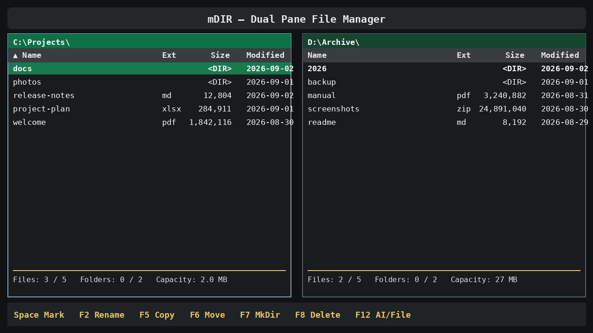

# mDIR-U

**A fast, free dual-pane file manager for Ubuntu.** Classic MDIR speed,
modern previews, safe file operations, and optional AI —
built for Linux terminals and the Ubuntu desktop.

[](https://github.com/jtl-sun/mdir-u/releases/latest)
[](LICENSE)
[](https://github.com/jtl-sun/mdir-u/actions)

> **Free and open source.** Built so Ubuntu users can manage files quickly
> without subscriptions, ads, or account registration.

### Download for Ubuntu

[**Download mDIR-U 2.23.29**](https://github.com/jtl-sun/mdir-u/releases/tag/v2.23.29)
· [Windows version](https://github.com/jtl-sun/mdir-p)

```bash
git clone https://github.com/jtl-sun/mdir-u.git
cd mdir-u
./install_ubuntu.sh
```

Then open **mDIR** from the application menu or type `u` in a terminal.



mDIR-U is a tribute to **Choi Jung Han**, developer of the legendary MDIR
file manager from the DOS era.

## Highlights

- Fast dual-pane file management with editable paths
- Responsive Copy, Move, and Delete for selections exceeding 1,000 items
- Compact overwrite warning before Copy or Move replaces a same-name item
- Background directory scans that show the first 250 rows quickly, even in
  directories containing tens of thousands of files
- Preview for images, PDF documents, and Excel workbooks
- Safe text viewing with F3 and interactive nano editing with F4
- Advanced filename and content search
- Safe batch rename with find/delete and optional end numbering, plus secure
  ZIP creation/extraction
- Clickable path segments, green active-pane styling, and clear item details
- Exact comma-separated byte sizes, compact centered column headings, and
  visible ascending/descending sort arrows
- Direct mouse selection on any visible page; a first click only selects,
  fast double-click opens, and a deliberate slow click pair starts Rename
- Right-click selection anchors followed by Shift+left-click range selection
- Files below 10 GB and directories go to the Ubuntu Trash; files of 10 GB or
  more require permanent deletion
- Ubuntu locations, mounted filesystem selection, and desktop opening
- Optional Codex, Ollama, and local shell panel
- Configurable top shortcut bar

Preview is disabled at startup. Press `Ctrl+F3` to show or hide it.

## Easy Ubuntu installation or update

Install Git once if needed, download MDIR-U, and run the installer:

```bash
sudo apt update
sudo apt install -y git
git clone https://github.com/jtl-sun/mdir-u.git
cd mdir-u
./install_ubuntu.sh
```

The installer:

- installs the required Ubuntu packages, including nano;
- creates a private environment under `~/.local/share/mdir-u`;
- installs all Preview dependencies;
- creates permanent `u`, `U`, and `mdir-u` commands;
- adds `~/.local/bin` to your login PATH when necessary; and
- adds **mDIR** to the Ubuntu application menu with its own icon.
- verifies that the installed version exactly matches the downloaded source.

The installer can be run again at any time. It safely updates the program and
keeps personal settings.

### Update a Git installation

```bash
cd ~/mdir-u
git pull
./install_ubuntu.sh
```

If you cloned it somewhere else, change `~/mdir-u` to that directory.

### Install from a downloaded ZIP

1. Download **Code > Download ZIP** from this GitHub page.
2. Extract the ZIP and open a terminal in the `mdir-u-main` folder.
3. Run:

```bash
chmod +x install_ubuntu.sh
./install_ubuntu.sh
```

### Run

Open **mDIR** from the Ubuntu application menu, or use:

```bash
u
U
mdir-u
```

If the current terminal was open before installation and cannot find `u`,
either open a new terminal or run:

```bash
export PATH="$HOME/.local/bin:$PATH"
```

### Uninstall

```bash
./uninstall_ubuntu.sh
```

This removes program files and launchers but preserves personal settings.

## Controls

| Key | Action |
| --- | --- |
| `Tab`, `Left`, `Right` | Switch active pane |
| Click anywhere in a pane | Activate the clicked pane |
| `Enter` | Open directory or file |
| `Backspace` | Parent directory |
| `Space` | Mark or unmark |
| `F2` | Rename |
| `Ctrl+F2` | Batch rename selected items |
| `F3` | View a supported text file |
| `F4` | Edit a supported text file with nano |
| `F5` | Copy |
| `F6` | Move |
| `Alt+F5` | Compress selected items to ZIP |
| `Alt+F6` | Extract the selected ZIP |
| `F7` | Create directory |
| `F8` | Delete |
| `F9` | Select a location or mount |
| `F10` | Quit |
| `F12` | Toggle AI/file pane |
| `Ctrl+F` | Advanced search |
| `Ctrl+F3` | Toggle document preview |
| `Ctrl+H` | Toggle hidden files |
| `Shift+F10` | Open a terminal at the selected directory |
| `Alt+Enter` | Show item properties |

Copy, Move, and Delete run in a background worker. Large batches show progress
and an ETA; press `Esc` or choose **Cancel** to close the progress dialog
immediately and prevent another top-level item from starting.

A fast second click within 0.75 seconds opens the item. A deliberate second
click after 1.0–3.0 seconds starts Rename.

Batch Rename starts with the safe `[N]` pattern, one counter digit, and both
quick options OFF. Turn on **Delete found text** to remove a phrase, or **End
number** to append a counter only when requested.

## Top shortcut bar

Click **Edit Links** to edit shortcut names, types, targets, panes, and
arguments. MDIR-U stores these links in:

```text
~/.mdir-u-shortcuts.json
```

Supported link types are `folder`, `file`, `program`, `web`, `command`, and
`action`. Placeholders include `{home}`, `{project}`, `{current}`, `{left}`,
and `{right}`.

## AI and local shell

The AI panel is optional. Install and authenticate each provider CLI
separately. `Codex Local` and `Shell` use the current Linux account's direct
permissions, so review commands before running them.

## WSL notes

MDIR-U runs in WSL Ubuntu. Windows drives appear under `/mnt`, such as
`/mnt/c` and `/mnt/s`. Opening graphical applications requires WSLg or another
configured desktop opener.

## Development validation

```bash
python3 -m venv .venv
. .venv/bin/activate
python3 -m pip install -e ".[preview,dev]"
python3 -m mdir_u --check
python3 -m unittest discover -s tests -v
python3 -m build
```

## License

MDIR-U is released under the [MIT License](LICENSE). Attribution and the
license notice must be preserved when redistributing the software.
